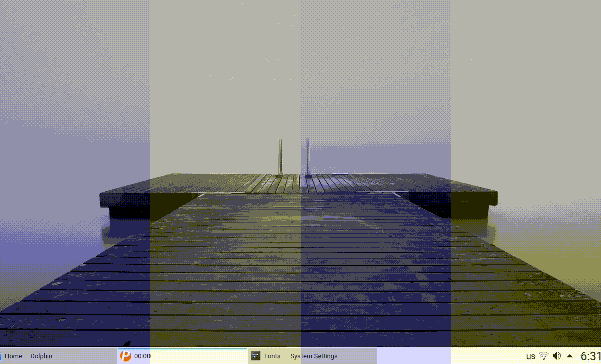

"Unminimize 1" is a KWin effect that animates the unminimizing of windows.

## Installation

### From source

```sh
git clone https://github.com/zzag/kwin-effects-unminimize1.git
cd kwin-effects-unminimize1
mkdir build && cd build
cmake -DCMAKE_INSTALL_PREFIX=/usr ..
make -jN
sudo make install
```
